<p align="center">
  
</p>

<p align="center">
  <a href="https://github.com/namadeku">
    
  </a>
</p>

<p align="center">
  
  
</p>

---

###  About me

```ts
const namadeku = {
  stack: ["Python", "TypeScript", "Node.js", "Web"],
  tools: ["uv", "pnpm", "Playwright", "Git"],
  os: "Windows 11",
  currentlyLearning: "something new every week",
  funFact: "if I do something twice, I write a script for it",
};
```

### 🛠️ Tech stack

<p align="center">
  <a href="https://skillicons.dev">
    
  </a>
  <br/><br/>
  <a href="https://skillicons.dev">
    
  </a>
</p>

### 📊 GitHub stats

<p align="center">
  
  
</p>

<p align="center">
  
</p>

### 🐍 Contributions

<p align="center">
  <picture>
    <source media="(prefers-color-scheme: dark)" srcset="https://raw.githubusercontent.com/namadeku/namadeku/output/github-snake-dark.svg" />
    <source media="(prefers-color-scheme: light)" srcset="https://raw.githubusercontent.com/namadeku/namadeku/output/github-snake.svg" />
    
  </picture>
</p>

<p align="center">
  
</p>
